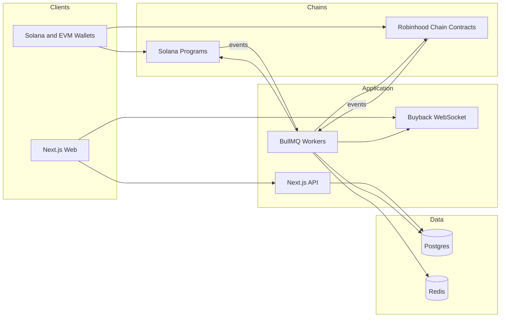
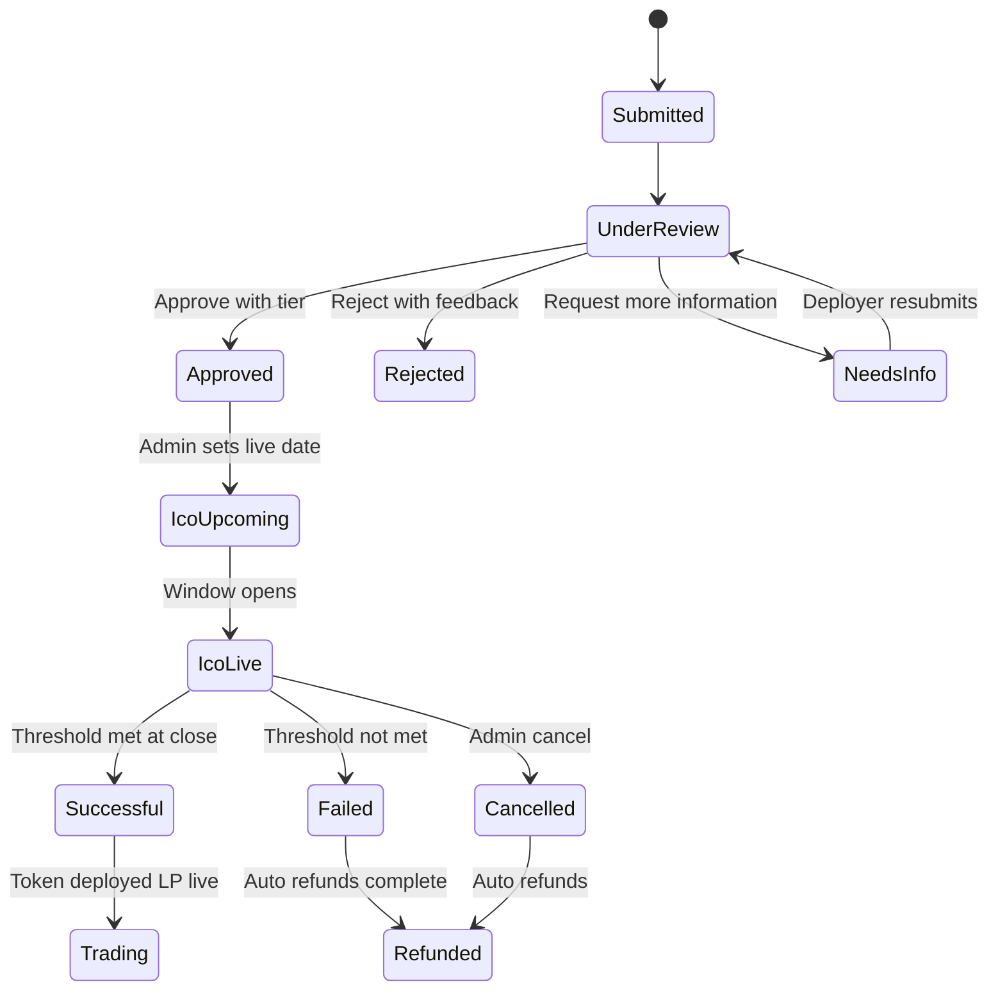
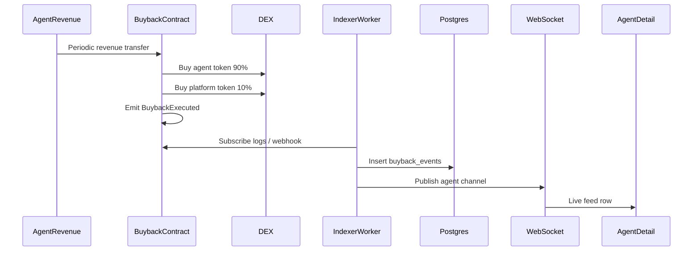
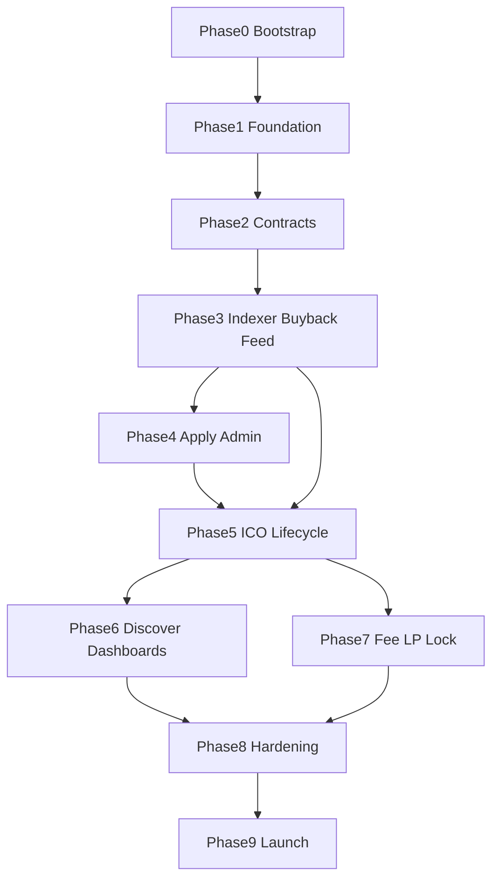

# Arca V1 — Product Requirements Document & Build Plan

**Status:** Internal — developer use only  
**Source of truth (product):** ARCA V1 Product Scope  
**Audience:** Engineering, product, design, smart-contract auditors  
**Goal:** Ship a production-ready V1 where the buyback engine is the centerpiece, not an afterthought.

---

## Table of contents

1. [Product overview](#1-product-overview)
2. [Goals, non-goals, and V2 exclusions](#2-goals-non-goals-and-v2-exclusions)
3. [Locked tech stack](#3-locked-tech-stack)
4. [Domain model: tiers, tokenomics, status](#4-domain-model-tiers-tokenomics-status)
5. [Personas and journeys](#5-personas-and-journeys)
6. [Functional requirements by page](#6-functional-requirements-by-page)
7. [Smart contract specifications](#7-smart-contract-specifications)
8. [Data model](#8-data-model)
9. [API and realtime surface](#9-api-and-realtime-surface)
10. [Non-functional and production requirements](#10-non-functional-and-production-requirements)
11. [Phased build plan](#11-phased-build-plan)
12. [Milestones, team shape, and definition of done](#12-milestones-team-shape-and-definition-of-done)
13. [Launch checklist](#13-launch-checklist)
14. [Risks and assumptions](#14-risks-and-assumptions)
15. [Appendix: requirement ID index](#15-appendix-requirement-id-index)

---

## 1. Product overview

### 1.1 Vision

Arca enables **verified AI agents** to raise capital through structured ICOs, **automatically return performance to investors via on-chain buybacks**, and give investors **transparent on-chain performance data** to make informed decisions.

### 1.2 Positioning

Every other launchpad raises capital and moves on. Arca raises capital and then **continuously proves the investment was right** through automated, verifiable, on-chain buybacks that anyone can check at any time.

| Layer | Role |
| --- | --- |
| ICO | How investors get in |
| Buyback engine | Why they stay and why they return for the next agent |
| Verified performance layer | How they decide with confidence |

### 1.3 Core mechanic (non-negotiable)

**The buyback engine is the product. Everything else is infrastructure around it.**

When an agent generates revenue, a percentage routes automatically to a buyback contract. The contract purchases tokens from the open market:

- **90%** → agent token
- **10%** → Arca platform token

Both execute simultaneously. Both are recorded on-chain. No human involvement.

Additional hard rules:

- Buybacks are **periodic**, not per-transaction. Frequency is configurable **at the platform level only**, never by the deployer.
- The deployer **cannot** modify, pause, or redirect the buyback split post-launch. It is locked in the smart contract.
- The buyback feed on the agent detail page, buyback history table, and buyback metrics in the investor dashboard are **core proof of concept**, not secondary features.

**Product success criterion:** If a visitor does not immediately understand that revenue flows back to token holders automatically and verifiably, the product has failed to communicate what it is.

### 1.4 V1 chain support

| Chain | Native currency | Notes |
| --- | --- | --- |
| **Solana** | SOL | Primary chain for V1 |
| **Robinhood Chain** | ETH | EVM-compatible Arbitrum L2; Chain ID mainnet `4663`, testnet `46630` |

Deployer selects which chain to launch the ICO on. Accepted contribution currency depends on that choice.

### 1.5 Personas

| Persona | Intent |
| --- | --- |
| **Agent Deployer** | “I have an AI agent generating revenue and I want to raise capital.” |
| **Investor / Trader** | “I want exposure to AI agents that actually earn.” |
| **Arca Admin** | Internal review, ICO ops, analytics, user controls — nobody else sees this layer. |

---

## 2. Goals, non-goals, and V2 exclusions

### 2.1 V1 goals

1. Ship dual-chain ICO + immutable buyback engine (Solana + Robinhood Chain).
2. Surface verified on-chain performance as the primary decision surface (Agent Detail).
3. Make live buybacks impossible to miss in product UX.
4. Support admin-gated listing with tier and risk assignment (not permissionless).
5. Enforce fixed tokenomics and raise math (1B supply, 50/20/20/10, raise = 10% FDV).
6. Reach production with audits, monitoring, refunds, claims, and operational runbooks.

### 2.2 Non-goals (V2 — do not build now)

- Agent builder / SDK / API
- Self-serve permissionless listing
- Cross-chain expansion beyond Solana and Robinhood Chain
- Marketplace
- KYC / KYB layer
- Governance
- Mobile app

### 2.3 Explicit product constraints

- Tiers are **admin-assigned**, never self-selected by deployers.
- Token allocation percentages are **locked**; deployers cannot change them.
- Raise target is **always** 10% of launch FDV (auto-calculated, not editable).
- Buyback split is **immutable** post-launch.

---

## 3. Locked tech stack

Chosen for high performance, design-heavy UI, and first-class dual-chain smart-contract workflows.

| Layer | Choice | Rationale |
| --- | --- | --- |
| App | **Next.js 15 (App Router) + TypeScript** | SSR/SSG for Discover and Agent Detail SEO; Route Handlers for API; strong animation and design ecosystem |
| UI | **Tailwind CSS + Framer Motion + custom design tokens** | Full control over brand, hero, live feeds, and motion without a heavy default component look |
| Charts / market UI | **TradingView Lightweight Charts** | High-performance price and performance charts |
| Realtime | **Dedicated WebSocket service** (Node) publishing from indexer/Redis | Live buyback feed is a product centerpiece; low latency required |
| EVM contracts (Robinhood) | **Solidity + Foundry** | Official RH tooling path; fast tests, scripts, verification on Blockscout |
| EVM client | **viem + wagmi** | Typed, performant EVM reads/writes; RH Chain ID `4663` / `46630` |
| Solana programs | **Anchor (Rust)** | Standard Solana program framework |
| Solana client | **@solana/web3.js + wallet-adapter** | Wallet connect and program CPI client surface |
| RPC | **Alchemy** (Robinhood), **Helius** (Solana) | Production RPC/WS and webhooks; public RH RPCs are rate-limited |
| Data | **PostgreSQL + Drizzle ORM** | Relational model for agents, applications, ICOs, investments, reviews |
| Cache / jobs | **Redis + BullMQ** | Indexing, finalize/refund jobs, buyback scheduling, rate limits |
| Indexing | **Chain workers** (viem log subscription / Alchemy WS on RH; Helius webhooks on Solana) | Persist contributions, buybacks, fees into Postgres |
| Auth | **Wallet-first**: SIWE (EVM) + Sign-in-with-Solana; separate **admin session** (email/SSO + RBAC) | Matches investor/deployer flows; admins are not wallet-gated the same way |
| Hosting | **Vercel** (web) + **Fly.io or Railway** (workers, indexer, WS) + managed Postgres/Redis | Persistent processes required for buyback monitoring |
| Observability | **Sentry + OpenTelemetry + PagerDuty/Slack alerts** | Missed buybacks and failed finalizations are P0 |
| Repo shape | **pnpm monorepo** (`apps/web`, `apps/workers`, `apps/ws`, `packages/db`, `packages/contracts-evm`, `packages/programs-solana`, `packages/shared`) | Clear boundaries for contracts vs app vs indexers |

### 3.1 Architecture diagram

### 3.2 Robinhood Chain network constants

| Property | Mainnet | Testnet |
| --- | --- | --- |
| Chain ID | `4663` | `46630` |
| Currency | ETH | ETH |
| Explorer | robinhoodchain.blockscout.com | explorer.testnet.chain.robinhood.com |
| Production RPC | Alchemy / QuickNode (not public rate-limited RPC) | Alchemy testnet |

DEX assumption for open-market buybacks on RH: **Uniswap** (or RH-ecosystem AMM available at launch). On Solana: **Jupiter** aggregator (Raydium pools as primary liquidity source).

---

## 4. Domain model: tiers, tokenomics, status

### 4.1 Tiers (admin-assigned)

Every listed agent is assigned a tier by admin during review. Tier is **not** self-selected. Frontend reads and displays the tier field from the database. No dynamic self-serve tier engine is required in V1.

| Tier | Typical FDV guidance | Open market allocation posture | Profile |
| --- | --- | --- | --- |
| **Seed** | $150K FDV | Higher open market alloc (narrative) | Early stage; less proven revenue; higher variance / upside |
| **Core** | $500K FDV | Balanced | Proven revenue and documented track record |
| **Pro** | $1M+ FDV | Lower open market alloc (narrative) | Institutional-grade; sustained high-volume revenue; **priority access for Arca platform token holders** |

**FR-TIER-01:** Admin assigns `Seed | Core | Pro` at approve time.  
**FR-TIER-02:** Deployer sees tier as read-only (empty / pending until assigned).  
**FR-TIER-03:** Pro tier surfaces platform-token-holder priority access rules in ICO UI when configured by admin/platform.

> Note: Scope narrative distinguishes open-market allocation posture by tier. On-chain token bucket percentages remain the fixed 50/20/20/10 split for all launches. Tier-specific open-market posture is a **product/display and listing policy** concern unless/until ops defines additional LP seeding parameters per tier in PlatformConfig.

### 4.2 Standard token allocation (locked)

All agent launches use a fixed total supply of **1,000,000,000** tokens. Deployers cannot change percentages.

| Bucket | Allocation | Tokens | Notes |
| --- | --- | --- | --- |
| Open Market / LP | 50% | 500,000,000 | Liquid at launch; seeded as liquidity |
| Agent Wallet | 20% | 200,000,000 | Permanently locked; only released if full operational capital raised during ICO is fully deployed |
| Deployer | 20% | 200,000,000 | Linear vested; cliff and schedule configurable |
| Presale Participants | 10% | 100,000,000 | Distributed to ICO participants at close |

**Critical distinction:**

- **ICO raise (SOL/ETH)** → agent **operational wallet** (trading capital). More raised ⇒ larger positions ⇒ higher revenue potential.
- **20% agent wallet allocation** → locked **token supply**, separate from operational capital. Not trading capital.

**Raise math:**

- Raise target = **10% of launch FDV** (auto-calculated, not editable by deployer).
- Example: FDV $500K ⇒ raise target $50K.
- Raise threshold: **minimum 50%**, configurable up to **80%** by deployer at application time.
- Funds raised go directly to the agent’s operational wallet on successful close.

### 4.3 Buyback split (immutable)

| Destination | Share | Mutable post-launch? |
| --- | --- | --- |
| Agent token open-market buy | 90% | No |
| Platform token open-market buy | 10% | No |

Platform buyback frequency: platform-level config only.

### 4.4 Platform trading fee

- **1%** trading fee on all agent token transactions.
- Split **50/50**: Arca treasury ↔ agent deployer.
- Arca’s 50% goes to **treasury**, **not** routed to the buyback contract.

### 4.5 Launch status state machine

Statuses for product/UI: `Submitted`, `Under Review`, `Approved`, `ICO Upcoming`, `ICO Live`, `Successful`, `Failed`, `Refunded`, plus post-launch `Trading`. Internal: `Rejected`, `NeedsInfo`, `Cancelled`.

---

## 5. Personas and journeys

### 5.1 Deployer journey

1. Connect wallet (Solana or EVM depending on intended launch chain).
2. Complete multi-step application: profile → revenue verification → ICO configuration → tokenomics preview → submit.
3. Wait for admin review (tier + risk assigned).
4. On approval, admin sets live date → ICO Upcoming → Live.
5. Post-launch: monitor capital, operational wallet, revenue, buybacks, price, circulating supply.

### 5.2 Investor journey

1. Land on Homepage / Discover; understand buyback thesis immediately.
2. Open Agent Detail (Verified Performance Layer); inspect metrics + live buybacks.
3. Participate in ICO (SOL or ETH by chain); see allocation and threshold progress.
4. Claim tokens on success, or receive automatic refund on failure.
5. Track holdings, PnL, and buyback events in Investor Dashboard; trade post-launch.

### 5.3 Admin journey

1. Review queue: profile, revenue wallets, circularity flag, socials, optional code/strategy review.
2. Assign risk rating (`Low | Medium | High`) and tier; approve / reject / request info.
3. Manage ICO: set live date, monitor raise, pause if needed, cancel+refund, confirm success + trigger token deployment.
4. Monitor buyback engine health post-launch.
5. Platform analytics and user management.

---

## 6. Functional requirements by page

Core pages in **priority order**. Each requirement is testable.

### 6.1 Homepage — FR-HOME

**Purpose:** Category positioning, waitlist, how it works. Buyback-first narrative.

| ID | Requirement | Acceptance criteria |
| --- | --- | --- |
| FR-HOME-01 | Brand + positioning that Arca is the verified AI agent capital market with automatic on-chain buybacks | First viewport communicates revenue → buyback without requiring scroll into secondary sections |
| FR-HOME-02 | How it works section explains ICO → revenue → 90/10 buyback → verifiable on-chain | Includes simple diagram of buyback flow |
| FR-HOME-03 | Waitlist capture (email) with confirmation | Duplicate emails handled idempotently; stored in `waitlist` |
| FR-HOME-04 | CTA to Discover and/or Apply (gated by launch phase if needed) | Links work; gated mode shows waitlist-only when configured |
| FR-HOME-05 | Motion: at least 2–3 intentional animations supporting hierarchy (not noise) | Respects `prefers-reduced-motion` |

### 6.2 Discover Agents — FR-DISC

**Purpose:** Browse, filter, sort listed agents.

| ID | Requirement | Acceptance criteria |
| --- | --- | --- |
| FR-DISC-01 | List all publicly listed agents | Pagination or infinite scroll; empty state |
| FR-DISC-02 | Search by name | Case-insensitive; debounced |
| FR-DISC-03 | Filter: category (`Trading`, `Prediction`, `Arbitrage`, `Yield`, `Research`, `Other`) | Multi or single select as designed; URL-synced query params |
| FR-DISC-04 | Filter: tier (`Seed`, `Core`, `Pro`) | Works |
| FR-DISC-05 | Filter: status (`ICO Upcoming`, `ICO Live`, `Trading`) | Works |
| FR-DISC-06 | Sort: revenue, win rate, age, raise progress | High→low / low→high |
| FR-DISC-07 | Agent card shows: name, logo, tier badge, category, revenue, win rate, price, 24h change, mini chart, **live buyback indicator**, Trade or Participate CTA | Buyback indicator updates when recent buyback exists (≤ platform freshness SLA) |

### 6.3 Agent Detail Page — FR-DET (most important page)

**Purpose:** Verified Performance Layer. CoinMarketCap meets hedge-fund data room.

#### Hero

| ID | Requirement | Acceptance criteria |
| --- | --- | --- |
| FR-DET-01 | Name, logo, category, one-line description | Present |
| FR-DET-02 | Tier badge with tooltip explaining Seed / Core / Pro | Tooltip content accurate per §4.1 |
| FR-DET-03 | Status indicator: ICO Live / Trading / Upcoming | Correct mapping |
| FR-DET-04 | **Live buyback feed** of recent buyback events in real time | New events appear without full page reload via WebSocket; shows amount, split, relative time, link to explorer |

#### Performance metrics (on-chain / verified)

| ID | Requirement |
| --- | --- |
| FR-DET-10 | Total revenue generated |
| FR-DET-11 | Trading volume |
| FR-DET-12 | Win rate |
| FR-DET-13 | Average monthly return |
| FR-DET-14 | Drawdown history (chart) |
| FR-DET-15 | Capital deployed (operational wallet balance) |
| FR-DET-16 | Wallet age |
| FR-DET-17 | Number of positions / transactions |
| FR-DET-18 | Risk rating (admin-assigned Low / Medium / High) |

#### Raise details

| ID | Requirement | Acceptance criteria |
| --- | --- | --- |
| FR-DET-20 | Raise target shown as 10% of launch FDV | Copy makes the relationship clear |
| FR-DET-21 | Amount raised + progress bar | Updates from indexer/API |
| FR-DET-22 | **50% threshold marker** visible on progress bar | Marker position = configured threshold (50–80%) |
| FR-DET-23 | Time remaining, min ticket, token price, launch FDV, vesting terms | Present when ICO active/upcoming |

#### Tokenomics

| ID | Requirement | Acceptance criteria |
| --- | --- | --- |
| FR-DET-30 | Allocation chart 50/20/20/10 | Exact locked split |
| FR-DET-31 | Circulating supply schedule visualization | Reflects vesting + locks |
| FR-DET-32 | Buyback mechanic diagram (revenue → contract → 90/10 market buys) | Diagram present and accurate |

#### Documents & socials

| ID | Requirement |
| --- | --- |
| FR-DET-40 | Strategy overview |
| FR-DET-41 | Audit report if available |
| FR-DET-42 | Team profiles |
| FR-DET-43 | Socials, website, docs links |

#### Buyback history

| ID | Requirement | Acceptance criteria |
| --- | --- | --- |
| FR-DET-50 | Full historical buyback table | Date, amount, tokens purchased (agent + platform), tx hash |
| FR-DET-51 | Each row links to chain explorer | Solana explorer or RH Blockscout by chain |
| FR-DET-52 | Anyone can verify on-chain from public data | No login required to view history |

### 6.4 ICO / Participate Page — FR-ICO

| ID | Requirement | Acceptance criteria |
| --- | --- | --- |
| FR-ICO-01 | Connect wallet for the agent’s chain | Solana wallet for SOL ICOs; EVM wallet for RH ICOs |
| FR-ICO-02 | Enter contribution in SOL or ETH | Rejects wrong chain / insufficient balance with clear errors |
| FR-ICO-03 | Live token allocation preview as amount is entered | Uses ICO pricing formula; updates immediately |
| FR-ICO-04 | Raise progress bar with threshold marker | Same as detail page |
| FR-ICO-05 | Countdown timer to close | Timezone-safe; ends at on-chain/window close |
| FR-ICO-06 | Enforce minimum ticket | Client + contract |
| FR-ICO-07 | Automatic refund if threshold not met at close | User can claim/refund path; no admin manual send required for happy path |
| FR-ICO-08 | On success: token claim / distribution flow | Claim UI in Investor Dashboard + ICO page as appropriate |

### 6.5 Investor Dashboard — FR-INV

| ID | Requirement |
| --- | --- |
| FR-INV-01 | My investments: all agents participated in |
| FR-INV-02 | Token claims post-ICO |
| FR-INV-03 | Holdings value (live) |
| FR-INV-04 | PnL per agent |
| FR-INV-05 | Buyback events received / relevant to holdings (**core**) |
| FR-INV-06 | Transaction history (contributions, claims, refunds, trades if indexed) |

### 6.6 Deployer Dashboard — FR-DEP

| ID | Requirement |
| --- | --- |
| FR-DEP-01 | Capital raised |
| FR-DEP-02 | Operational wallet balance (ICO funds) |
| FR-DEP-03 | Revenue generated to date |
| FR-DEP-04 | Buybacks executed: count, volume, token impact (**core**) |
| FR-DEP-05 | Current token price |
| FR-DEP-06 | Circulating supply |

### 6.7 Admin Dashboard — FR-ADM

#### Review queue

| ID | Requirement |
| --- | --- |
| FR-ADM-01 | Incoming applications list with status filters |
| FR-ADM-02 | Agent profile review UI |
| FR-ADM-03 | Revenue wallet analysis view (metrics from §6.8 verification) |
| FR-ADM-04 | Circularity check: automated flag + manual review notes |
| FR-ADM-05 | Code / strategy review notes if submitted |
| FR-ADM-06 | Social verification checklist |
| FR-ADM-07 | Assign risk rating: Low / Medium / High |
| FR-ADM-08 | Assign tier: Seed / Core / Pro |
| FR-ADM-09 | Actions: Approve with tier / Reject with feedback / Request more information |

#### ICO management

| ID | Requirement |
| --- | --- |
| FR-ADM-20 | Set live date |
| FR-ADM-21 | Monitor raise progress in real time |
| FR-ADM-22 | Pause if needed (admin-controlled; deployer cannot) |
| FR-ADM-23 | Cancel and trigger automatic refund |
| FR-ADM-24 | Confirm successful raise and trigger token deployment |
| FR-ADM-25 | Monitor post-launch buyback engine health (last success, failures, lag) |

#### Platform analytics

| ID | Requirement |
| --- | --- |
| FR-ADM-30 | Total revenue across all agents |
| FR-ADM-31 | Total raised across all ICOs |
| FR-ADM-32 | Total buybacks executed |
| FR-ADM-33 | Platform token buyback volume |
| FR-ADM-34 | Active users: investors and deployers |
| FR-ADM-35 | Fee revenue to Arca treasury |

#### User management

| ID | Requirement |
| --- | --- |
| FR-ADM-40 | Investor list |
| FR-ADM-41 | Deployer list |
| FR-ADM-42 | Admin access controls (RBAC) |

### 6.8 Application Flow — FR-APP

Multi-step deployer onboarding.

#### Step 1 — Agent profile

| ID | Requirement |
| --- | --- |
| FR-APP-01 | Agent name, description, logo upload |
| FR-APP-02 | Category: Trading, Prediction, Arbitrage, Yield, Research, Other |
| FR-APP-03 | Tier displayed read-only (assigned later by admin) |
| FR-APP-04 | Website, documentation, socials |
| FR-APP-05 | Team: names, roles, public profiles |

#### Step 2 — Revenue verification

| ID | Requirement |
| --- | --- |
| FR-APP-10 | Connect primary revenue wallet(s) on Solana and/or Robinhood Chain |
| FR-APP-11 | Auto-pull on-chain: total revenue, trading volume, tx count, PnL, win rate (trading), drawdown history, wallet age |
| FR-APP-12 | Counterparty analysis → internal circularity flag |
| FR-APP-13 | Manual upload of supporting documentation (required) |

#### Step 3 — ICO configuration

| ID | Requirement | Acceptance criteria |
| --- | --- | --- |
| FR-APP-20 | Chain selection: Solana or Robinhood Chain | Locks contribution currency |
| FR-APP-21 | Launch FDV set by deployer | Validated numeric bounds per platform policy |
| FR-APP-22 | Raise target auto = 10% FDV | Not editable |
| FR-APP-23 | Total supply fixed 1,000,000,000 | Display only |
| FR-APP-24 | Token allocation locked to Arca defaults | Display only |
| FR-APP-25 | Raise threshold 50% min, configurable up to 80% | Validation |
| FR-APP-26 | Deployer vesting: cliff + linear schedule | Stored and shown in preview |
| FR-APP-27 | Buyback split shown (90/10) read-only | Cannot change |
| FR-APP-28 | Preview tokenomics before submission | Must acknowledge preview to submit |
| FR-APP-29 | Submit → status `Submitted` | Confirmation + appears in admin queue |

---

## 7. Smart contract specifications

Parity of behavior on **Solana (Anchor)** and **Robinhood Chain (Solidity/Foundry)**. Implementation details differ; invariants must match.

### 7.1 Shared invariants

| ID | Invariant |
| --- | --- |
| SC-INV-01 | Buyback split fixed at 90/10 forever after launch initialization |
| SC-INV-02 | Deployer cannot modify, pause, or redirect buyback routing |
| SC-INV-03 | Only admin/platform roles may pause ICO contribution window (where pause exists) |
| SC-INV-04 | Raise threshold unmet at close ⇒ contributors can refund; no token distribution |
| SC-INV-05 | Raise threshold met ⇒ tokens distributed / claimable; SOL/ETH to operational wallet |
| SC-INV-06 | Agent token allocation 20% locked until release condition; else permanent lock |
| SC-INV-07 | Trading fee 1%; treasury share never auto-routes to buyback |
| SC-INV-08 | All buybacks emit public events with amounts and tx identity |

### 7.2 ICO Contract / Program

**Responsibilities**

- Accept SOL (Solana) or ETH (Robinhood) during raise window.
- Track contributions per wallet.
- Enforce minimum ticket.
- Enforce raise threshold (50–80% as configured at deploy).
- Automatic refund path if threshold not met at close (and on admin cancel).
- Token distribution / claim at successful close.
- Deployer allocation with configurable vesting cliff + linear schedule.
- Seed open-market/LP allocation per launch parameters (orchestration may be factory + LP helper).

**Key parameters (immutable where noted)**

| Param | Mutable post-launch? |
| --- | --- |
| launch FDV / token price derivation | No (set at init) |
| raise target (10% FDV) | No |
| threshold_bps | No after init |
| min_ticket | No after init |
| raise window start/end | Admin may set before live; pause/cancel rules apply |
| vesting cliff/duration | No after init |
| buyback split | N/A on ICO; enforced on Buyback contract |

**Events (logical)**

- `Contribution(wallet, amount, timestamp)`
- `Refund(wallet, amount, timestamp)`
- `RaiseFinalized(success, totalRaised, timestamp)`
- `TokensClaimed(wallet, amount)`
- `Paused` / `Cancelled` (admin)

**Acceptance tests**

- Contribute below min ticket → revert.
- Close below threshold → refundable; claim tokens → revert.
- Close at/above threshold → operational wallet receives funds; claims work proportional to contribution within 10% presale bucket.
- Deployer tokens unlock only per vesting schedule.

### 7.3 Buyback Contract / Program

**Responsibilities**

- Receive revenue from agent operational flow on a **periodic** schedule (keeper/cron authorized by platform, not deployer).
- Execute 90% agent-token market buy + 10% platform-token market buy atomically (or in a single authorized execution with both legs recorded).
- Emit on-chain event per buyback.
- Refuse any deployer attempt to change split, pause, or redirect.

**Parameters**

| Param | Owner |
| --- | --- |
| split_agent_bps = 9000 | Immutable |
| split_platform_bps = 1000 | Immutable |
| buyback_frequency | Platform config |
| DEX router / pool allowlist | Platform (upgrade carefully; prefer immutable router + allowlist with timelock) |

**Events**

- `BuybackExecuted(agentTokenAmountSpent, platformTokenAmountSpent, agentTokensBought, platformTokensBought, timestamp)`

**Acceptance tests**

- Any call attempting to change split → revert.
- Deployer-signed pause → revert (no such role).
- Execution with insufficient liquidity → fail safely, alert ops, do not strand accounting incorrectly (define pull-payment / retry accounting).
- Event indexed by off-chain worker within freshness SLA.

### 7.4 Agent Wallet (locked 20% supply)

**Responsibilities**

- Hold 20% of token supply at launch.
- Permanently locked by default.
- Release **only if** full operational capital raised during ICO is **fully deployed** (definition: operational wallet drawdown/deployment attested by oracle or admin-attested on-chain condition — see risks).
- Otherwise remains permanent locked supply (reduces effective circulating supply).

**Acceptance tests**

- Premature release → revert.
- Release condition false → balance unchanged.
- Release condition true → tokens transferable per defined recipient rules (document recipient: agent ops vs burn vs further lock — **product default: release to agent operational control as specified by ops; must be fixed before audit**).

### 7.5 Platform Fee Contract / hook

**Responsibilities**

- Collect **1%** trading fee on agent token transactions (via pool fee tier, transfer hook, or DEX fee routing — chain-appropriate mechanism).
- Split 50/50 treasury / deployer.
- Treasury share **must not** auto-send to buyback contract.

**Events**

- `FeeCollected(amount, treasuryShare, deployerShare, pairOrPool)`

### 7.6 Factory / launch orchestration

Recommended pattern:

1. Admin approves application off-chain.
2. On successful raise finalize, factory deploys or initializes: token, LP seed, buyback, locked agent wallet, vesting, fee routing.
3. Addresses written back to Postgres for indexing and UI.

### 7.7 Security requirements

| ID | Requirement |
| --- | --- |
| SC-SEC-01 | External audit before mainnet for both Solana programs and EVM contracts |
| SC-SEC-02 | Admin actions behind multisig (e.g. Gnosis Safe on RH; Squads on Solana) |
| SC-SEC-03 | Timelock for any upgradeable components; prefer immutable buyback split with minimal upgrade surface |
| SC-SEC-04 | Comprehensive Foundry + Anchor tests including fuzz and invariant tests for accounting |
| SC-SEC-05 | Reentrancy, oracle manipulation, sandwiching on buyback swaps considered in design (private mempool / TWAP / max slippage caps) |
| SC-SEC-06 | Emergency pause limited to ICO contribution / fee modules as designed — **never** to rewrite buyback split |

### 7.8 Dual-chain delivery notes

| Concern | Robinhood Chain | Solana |
| --- | --- | --- |
| Language | Solidity 0.8.x + Foundry | Rust + Anchor |
| Token standard | ERC-20 | SPL Token / Token-2022 (decide pre-build; Token-2022 if transfer hooks needed for fees) |
| DEX buybacks | Uniswap v3/v4 style router | Jupiter CPI or direct AMM |
| Verification | Blockscout | Solana explorer / verified IDL publish |
| Keeper | Platform worker submits EVM txs | Platform worker submits txs as authorized crank |

---

## 8. Data model

PostgreSQL via Drizzle. IDs: UUIDs. Money: numeric/decimal strings; also store raw chain amounts as strings.

### 8.1 Core entities

**users**

- `id`, `role` (`investor` | `deployer` | `admin` | multi-role join table preferred)
- `created_at`

**wallets**

- `id`, `user_id`, `chain` (`solana` | `robinhood`), `address`, `is_primary`, `verified_at`

**agents**

- `id`, `slug`, `name`, `description`, `one_liner`, `logo_url`
- `category`, `tier` (nullable until approved), `risk_rating` (nullable until review)
- `status`, `chain`, `website`, `docs_url`, `socials` (jsonb)
- `launch_fdv_usd`, `raise_target_usd`, `raise_threshold_bps`, `min_ticket_native`
- `token_address`, `ico_address`, `buyback_address`, `agent_wallet_address`, `operational_wallet_address`
- `created_by_user_id`, timestamps

**agent_team_members** — name, role, profile_url, agent_id  

**agent_documents** — type (`strategy` | `audit` | `other`), url, agent_id  

**applications** — agent_id, payload snapshot, status, submitted_at  

**reviews** — application_id, admin_id, circularity_flag, notes, decision, tier_assigned, risk_assigned, decided_at  

**revenue_wallets** — agent_id, chain, address, metrics snapshot jsonb, last_synced_at  

**icos** — agent_id, starts_at, ends_at, total_raised_native, contributor_count, finalized_at, outcome  

**contributions** — ico_id, wallet_address, amount_native, tx_hash, refunded_at, claim_tx_hash  

**vesting_schedules** — agent_id, cliff_seconds, duration_seconds, beneficiary  

**buyback_events** — agent_id, chain, tx_hash, revenue_spent, agent_tokens_bought, platform_tokens_bought, amounts, block_time, raw_event jsonb  

**fee_events** — agent_id, tx_hash, total_fee, treasury_share, deployer_share, block_time  

**platform_config** — buyback_frequency, feature flags, waitlist_only, fee_bps, etc.  

**waitlist** — email, created_at, unique email  

**admin_audit_log** — actor_id, action, entity, metadata, created_at  

### 8.2 Indexer freshness

- Store `indexer_checkpoints` per chain/program.
- Reorg handling: confirmations threshold (RH: N blocks; Solana: commitment `confirmed`/`finalized` policy documented).

---

## 9. API and realtime surface

Prefer **tRPC** (or versioned REST) on Next.js Route Handlers + separate worker auth via service tokens.

### 9.1 Public

| Method | Path / procedure | Purpose |
| --- | --- | --- |
| GET | `agents.list` | Discover filters/sort/pagination |
| GET | `agents.bySlug` | Agent detail aggregate |
| GET | `agents.buybacks` | Paginated buyback history |
| GET | `icos.byAgent` | Raise progress, timing |
| POST | `waitlist.join` | Homepage waitlist |

### 9.2 Authenticated (wallet session)

| Procedure | Purpose |
| --- | --- |
| `auth.nonce` / `auth.verify` | SIWE or SIWS |
| `applications.create` / `update` / `submit` | Deployer flow |
| `investor.portfolio` | Dashboard |
| `investor.claims` | Claimable positions |
| `deployer.dashboard` | Deployer metrics |

### 9.3 Admin (session + RBAC)

| Procedure | Purpose |
| --- | --- |
| `admin.applications.list` | Review queue |
| `admin.applications.decide` | Approve/reject/needs info + tier/risk |
| `admin.ico.setSchedule` | Live date |
| `admin.ico.pause` / `cancel` / `finalize` | Ops |
| `admin.analytics.overview` | Platform KPIs |
| `admin.users.*` | User management |

### 9.4 Realtime

**WebSocket channels**

- `agent:{id}:buybacks` — push new `buyback_events`
- `ico:{id}:progress` — raised amount updates

**SLA:** End-to-end from chain inclusion → UI toast/feed ≤ **15s** p95 on testnet; ≤ **30s** p95 on mainnet under normal RPC conditions.

### 9.5 Buyback pipeline

---

## 10. Non-functional and production requirements

### 10.1 Performance

| ID | Target |
| --- | --- |
| NFR-PERF-01 | Agent Detail LCP ≤ 2.5s on broadband desktop |
| NFR-PERF-02 | Discover interaction to filtered results ≤ 300ms after cache warm |
| NFR-PERF-03 | Buyback WS push p95 ≤ 15s testnet / 30s mainnet from inclusion |
| NFR-PERF-04 | API p95 read endpoints ≤ 200ms excluding cold chain calls |
| NFR-PERF-05 | Charts virtualize long buyback history (1000+ rows) |

### 10.2 Security

| ID | Requirement |
| --- | --- |
| NFR-SEC-01 | Wallet auth with domain-bound signatures; short-lived sessions |
| NFR-SEC-02 | Admin RBAC; all admin mutations audit-logged |
| NFR-SEC-03 | Secrets in vault/env only; no keys in client bundles |
| NFR-SEC-04 | Rate limits on auth, waitlist, contribute prep endpoints |
| NFR-SEC-05 | CSRF protection for cookie sessions; strict CORS |
| NFR-SEC-06 | File uploads scanned/size-limited (logos, documents) |
| NFR-SEC-07 | Dependency scanning + CI lockfiles |

### 10.3 Reliability

| ID | Requirement |
| --- | --- |
| NFR-REL-01 | Finalize/refund/claim jobs idempotent |
| NFR-REL-02 | Indexer resumes from checkpoint after crash |
| NFR-REL-03 | Missed buyback execution → PagerDuty within 2× frequency window |
| NFR-REL-04 | Chain reorg: reorg-safe writes with confirmation depth |
| NFR-REL-05 | DB backups daily + PITR |

### 10.4 Compliance posture (V1)

- **No KYC/KYB** in V1 (explicit non-goal).
- Document legal risk; optional soft geo/blocklist hooks only if counsel requires — not a product feature buildout.
- Clear UI disclaimers: experimental software, smart-contract risk, not financial advice.

### 10.5 Environments

| Env | Solana | Robinhood | App |
| --- | --- | --- | --- |
| Local | localnet / devnet | Anvil fork or RH testnet | docker-compose Postgres/Redis |
| Staging | devnet | RH testnet `46630` | staging URLs |
| Production | mainnet-beta | RH mainnet `4663` | prod |

### 10.6 Observability

- Sentry for web + workers.
- Metrics: raise progress lag, buyback success rate, indexer lag, RPC errors.
- Dashboards for admin buyback health mirrored in ops Grafana/provider UI.
- Runbooks: missed buyback, stuck finalize, RPC outage, refund surge.

### 10.7 Accessibility & design quality

- WCAG AA for core flows (contrast, focus, keyboard wallet-connect fallbacks where possible).
- Custom design tokens; avoid generic “AI purple” defaults.
- Buyback visualization must be visually dominant on Agent Detail.

---

## 11. Phased build plan

Buyback proof ships early (Phase 3) so the core thesis is validated before full ICO surface area expands.

### Phase 0 — Project bootstrap (3–5 days)

**Deliverables**

- pnpm monorepo, ESLint/Prettier, CI (typecheck, test, lint)
- `apps/web` Next.js scaffold + design tokens + base layout
- `packages/db` Drizzle schema skeleton + migrations
- Env templates, docker-compose for Postgres/Redis

**Exit criteria:** `pnpm` CI green; local app boots.

### Phase 1 — Foundation (1–2 weeks)

**Deliverables**

- Wallet connect: Solana adapter + wagmi/viem for Robinhood Chain (`46630` first)
- SIWE + SIWS auth sessions
- Homepage shell + waitlist API
- Design system primitives (typography, color, motion utilities)
- Admin auth scaffolding (RBAC stub)

**Exit criteria:** User can connect either wallet, sign in, join waitlist; RH + Solana network configs documented.

### Phase 2 — Contracts MVP (2–4 weeks, parallel tracks)

**EVM (Foundry)**

- ICO + Buyback + LockedAgentWallet + Fee module skeletons on RH testnet
- Unit, fuzz, invariant tests
- Deploy scripts + Blockscout verify

**Solana (Anchor)**

- Parity programs for ICO, buyback crank, locked vault, fee path
- IDL publish + typescript clients in `packages/shared`

**Exit criteria:** Testnet deploy both chains; demo script executes contribution → finalize path and a simulated buyback emitting events.

### Phase 3 — Indexer + Buyback feed (centerpiece vertical slice) (1–2 weeks)

**Deliverables**

- Workers ingest buyback + contribution events
- Postgres persistence
- WebSocket `agent:{id}:buybacks`
- Agent Detail page MVP: hero + **live buyback feed** + history table (can use fixture agent)
- Explorer links per chain

**Exit criteria:** Executing a testnet buyback appears in UI without refresh within SLA; public history verifiable.

### Phase 4 — Application + Admin review (2–3 weeks)

**Deliverables**

- Multi-step application UI (profile, revenue verification, ICO config, preview)
- Revenue wallet sync jobs (Solana + RH metrics); circularity heuristic flag
- Document uploads
- Admin review queue: approve/reject/needs info, tier + risk assignment
- Status transitions to Approved

**Exit criteria:** Full apply → review → approve path on staging with tier written to agent.

### Phase 5 — ICO lifecycle (2–3 weeks)

**Deliverables**

- Admin set live date; Upcoming / Live UI
- Participate page: contribute, allocation preview, threshold marker, countdown
- Finalize job: success → token deploy/LP orchestration hooks; failure → refunds
- Claims UI
- Pause/cancel + refund

**Exit criteria:** End-to-end testnet ICO on both chains: contribute → success claim and contribute → fail refund.

### Phase 6 — Discover + dashboards (2 weeks)

**Deliverables**

- Discover filters/sort/cards with live buyback indicator
- Investor dashboard (portfolio, claims, PnL, buybacks, history)
- Deployer dashboard (capital, ops wallet, revenue, buybacks, price, circulating)
- Admin platform analytics + user lists

**Exit criteria:** All eight core pages reachable with real staging data.

### Phase 7 — Fee + LP + locked agent wallet completion (1–2 weeks)

**Deliverables**

- 1% fee routing live on testnet pools
- LP seeding automation at success
- Locked 20% release condition implementation + admin/ops attestation flow as designed
- Circulating supply schedule accurate in UI

**Exit criteria:** Fee events indexed; locked supply behavior matches SC tests; treasury does not receive buyback-routed funds.

### Phase 8 — Production hardening (2–3 weeks)

**Deliverables**

- External audits (both chains); fix critical/high
- Load tests on Discover, Agent Detail, WS fanout
- Monitoring, alerts, runbooks
- Mainnet deploy scripts, multisig ownership transfer
- Security review of admin surfaces
- Legal disclaimers + incident process

**Exit criteria:** Audit sign-off for launch scope; P0 alert paths tested; mainnet dry-run on staging mirrors.

### Phase 9 — Launch

1. Homepage + waitlist publicly live (if not already).
2. Gated access / allowlist first deployers if needed.
3. First agents through review → ICO → buybacks observed publicly.
4. Post-launch hypercare (2 weeks): on-call for buyback/finalize.

---

## 12. Milestones, team shape, and definition of done

### 12.1 Suggested team shape (V1)

| Role | Focus |
| --- | --- |
| 1 Tech lead / full-stack | Architecture, Next.js, API |
| 1 Frontend / design engineer | Agent Detail, Discover, motion, charts |
| 1 EVM engineer | Foundry contracts, RH deploy, Uniswap buyback |
| 1 Solana engineer | Anchor programs, Jupiter buyback, crank |
| 1 Backend / indexing | Workers, WS, metrics sync |
| 0.5 DevOps | CI, Fly/Railway, secrets, alerts |
| Product + Admin ops | Review playbooks, tier policy |

### 12.2 Dependency graph (summary)

### 12.3 Definition of Done — production ready

V1 is production-ready when **all** are true:

1. All FR-* requirements in §6 implemented or explicitly waived in writing by product.
2. SC invariants SC-INV-01..08 hold on both chains with tests + audit.
3. Live buyback feed and history work on mainnet for at least one pilot agent.
4. ICO success and failure paths proven on both chains (claim + refund).
5. Admin can complete review → schedule → monitor → finalize/cancel.
6. Monitoring: indexer lag, buyback failures, finalize failures alerted.
7. Runbooks published; multisig owners documented.
8. V2 exclusions remain out of the codebase (no half-built SDK/KYC/mobile).

### 12.4 Rough calendar (indicative)

Assuming the team above and parallel Solana/EVM work: **~14–18 weeks** to production-ready pilot, then launch. Compress only by cutting parallel scope (e.g. Solana-first mainnet, RH immediately after) — if sequenced, document the sequence change explicitly; **this plan assumes dual-chain at launch**.

---

## 13. Launch checklist

### 13.1 Product / UX

- [ ] Homepage communicates buyback thesis above the fold
- [ ] Agent Detail live feed + history QA’d on both chains
- [ ] Discover filters and cards show buyback indicator
- [ ] ICO threshold marker and refund copy QA’d
- [ ] Investor and Deployer dashboards show buyback metrics
- [ ] Admin review + ICO ops dry-run completed
- [ ] Disclaimers and risk copy approved

### 13.2 Contracts

- [ ] Audit report published or linked (FR-DET-41)
- [ ] Multisig owns admin roles on both chains
- [ ] Buyback split immutability verified on deployed bytecode
- [ ] Fee split treasury path verified (not to buyback)
- [ ] Emergency procedures documented (pause ICO only)

### 13.3 Infra

- [ ] Alchemy (RH) + Helius (Solana) production keys + budgets
- [ ] Workers and WS highly available (min 2 instances)
- [ ] Postgres PITR + Redis persistence
- [ ] Sentry + PagerDuty buyback alert test fired successfully
- [ ] Domain, TLS, wallet auth domain allowlist correct

### 13.4 Go-live

- [ ] Platform token liquid enough for 10% buyback leg (or temporary accounting policy approved)
- [ ] First agent(s) approved with tier + risk
- [ ] Hypercare staffing roster
- [ ] Status page / incident comms channel

---

## 14. Risks and assumptions

| Risk / assumption | Impact | Mitigation |
| --- | --- | --- |
| RH DEX liquidity thin for buybacks | Buybacks fail or high slippage | Max slippage + retry; minimum liquidity gate before listing; alert ops |
| Platform token not liquid at T0 | 10% leg fails | Seed platform LP before first agent; or staged rollout policy |
| Revenue verification noisy / gameable | Bad listings | Circularity flag + manual review; docs required; admin tier conservatism |
| “Fully deployed operational capital” release condition ambiguous | Locked 20% disputes | Freeze precise attestation rule before audit (oracle vs admin multisig attestation) |
| MEV on buyback swaps | Poor execution | Slippage caps, private relay if available, TWAP for large periods |
| Dual-chain scope doubles delivery cost | Schedule slip | Keep shared product invariants; parallel engineers; shared TS clients |
| No KYC in V1 | Regulatory risk | Counsel review; geo soft-blocks only if required; disclaimers |
| Pro tier “priority access” underspecified | Incomplete FR-TIER-03 | Define allowlist rules (snapshot of platform token holders) in PlatformConfig before Pro ICO |
| Scope tier narrative vs fixed 50% open market bucket | Confusion | Keep on-chain split fixed; express tier posture in listing policy / FDV guidance |

---

## 15. Appendix: requirement ID index

| Prefix | Area |
| --- | --- |
| FR-HOME | Homepage |
| FR-DISC | Discover |
| FR-DET | Agent Detail |
| FR-ICO | ICO / Participate |
| FR-INV | Investor Dashboard |
| FR-DEP | Deployer Dashboard |
| FR-ADM | Admin |
| FR-APP | Application flow |
| FR-TIER | Tier policy |
| SC-INV | Contract invariants |
| SC-SEC | Contract security |
| NFR-* | Non-functional |

---

## Document control

| Field | Value |
| --- | --- |
| Product | Arca |
| Version | V1 |
| Doc | PRD + Build Plan |
| Chains | Solana + Robinhood Chain (EVM L2, ETH) |
| Centerpiece | Immutable periodic buyback engine (90/10) |
| Classification | Internal only |

**Key principle (repeat):** The ICO is how investors get in. The buyback engine is why they stay. If the buyback feed, history, and metrics are weak, the product has failed.

— arca · V1 PRD & Build Plan · @arcamarkets
