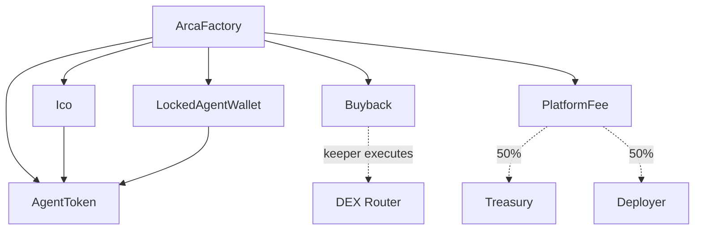

# @arca/contracts-evm

Arca V1 smart contracts for Robinhood Chain (EVM). This package contains the complete on-chain infrastructure for verified AI agent token launches with immutable buyback mechanics.

## Overview

Arca enables verified AI agents to raise capital through structured ICOs and **automatically return performance to investors via on-chain buybacks**. The buyback engine is the centerpiece of the entire system.

### Core Contracts

| Contract | Purpose | Key Features |
|----------|---------|-------------|
| `AgentToken.sol` | ERC20 token for agent | Fixed 1B supply (18 decimals) |
| `Ico.sol` | Token raise contract | Contributions, threshold enforcement, finalize, refunds, claims |
| `Buyback.sol` | **CENTERPIECE** | **Immutable 90/10 split**, keeper-only execution, no pause |
| `LockedAgentWallet.sol` | Locked 20% supply | Release only after operational capital deployed |
| `PlatformFee.sol` | Fee distribution | 50/50 split treasury/deployer, treasury NOT to buyback |
| `ArcaFactory.sol` | Orchestration | Deploy complete agent infrastructure |

## Product Invariants

These are **non-negotiable** and enforced by the smart contracts:

1. **Buyback split is IMMUTABLE** (90% agent token, 10% platform token) - cannot be changed post-deployment
2. **Deployer CANNOT pause buyback** - only platform keeper can execute
3. **Only admin can pause ICO** - deployer has no pause capability
4. **Treasury share NEVER auto-routes to buyback** - explicit separation
5. **Raise threshold: 50-80%** of target must be met for success
6. **Token allocation locked**: 50% open market, 20% locked agent wallet, 20% deployer vesting, 10% presale

## Token Allocation (Fixed)

All agent launches use a fixed total supply of **1,000,000,000 tokens** (1e9 * 1e18):

| Bucket | Allocation | Tokens | Notes |
|--------|------------|--------|-------|
| Open Market / LP | 50% | 500,000,000 | Liquid at launch |
| Agent Wallet | 20% | 200,000,000 | Locked until operational capital deployed |
| Deployer | 20% | 200,000,000 | Vested (configurable cliff + duration) |
| Presale Participants | 10% | 100,000,000 | Distributed to ICO contributors |

## Installation

```bash
# Install Foundry if not already installed
curl -L https://foundry.paradigm.xyz | bash
foundryup

# Install dependencies (if using submodules)
forge install OpenZeppelin/openzeppelin-contracts
forge install foundry-rs/forge-std

# Build contracts
npm run build
# or
forge build
```

## Testing

```bash
# Run all tests
npm test
# or
forge test

# Run with verbose output
npm run test:verbose
# or
forge test -vvv

# Run with gas reporting
npm run test:gas
# or
forge test --gas-report
```

### Key Test Coverage

All tests in `test/ArcaContracts.t.sol`:

- ✅ `test_BuybackSplitImmutable` - Verify 90/10 split cannot be changed
- ✅ `test_DeployerCannotPauseBuyback` - Verify no pause function exists
- ✅ `test_OnlyKeeperCanExecuteBuyback` - Keeper authorization
- ✅ `test_ContributeAndRefundBelowThreshold` - ICO refund path
- ✅ `test_ContributeAndFinalizeSuccess` - ICO success path with claims
- ✅ `test_EnforceMinTicket` - Minimum contribution enforcement
- ✅ `test_AdminCanPauseAndCancel` - Admin controls (not deployer)
- ✅ `test_FeeSplitTreasuryNotToBuyback` - Fee routing verification
- ✅ `test_LockedWalletCannotReleaseEarly` - Release authorization required
- ✅ `test_FactoryDeploysAgent` - Complete infrastructure deployment

## Deployment

### Deploy Platform Infrastructure

```bash
# Set environment variables
export PRIVATE_KEY=0x...
export TREASURY=0x...
export PLATFORM_ADMIN=0x...  # Multisig address
export KEEPER=0x...
export PLATFORM_TOKEN=0x...  # Optional, will deploy if not provided
export SWAP_ROUTER=0x...     # Optional, for DEX integration

# Deploy to Robinhood testnet
npm run deploy:testnet

# Deploy to Robinhood mainnet
npm run deploy:mainnet
```

### Deploy Agent via Factory

```bash
# Set agent-specific variables
export FACTORY_ADDRESS=0x...
export TOKEN_NAME="My Agent Token"
export TOKEN_SYMBOL="MAGT"
export OPERATIONAL_WALLET=0x...
export RAISE_TARGET=10000000000000000000  # 10 ETH in wei
export MIN_TICKET=100000000000000000      # 0.1 ETH in wei
export RAISE_THRESHOLD_BPS=5000           # 50% (optional, defaults to 5000)

# Deploy agent
forge script script/Deploy.s.sol:DeployAgent --rpc-url robinhood_testnet --broadcast
```

## Contract Architecture



## Usage Examples

### Contributing to ICO

```solidity
// User contributes ETH to ICO
ico.contribute{value: 1 ether}();

// Check contribution
uint256 contribution = ico.contributions(msg.sender);

// Check if threshold met
bool thresholdMet = ico.isThresholdMet();
```

### Claiming Tokens (After Success)

```solidity
// After ICO finalized successfully
ico.claimTokens();

// Check allocation
uint256 allocation = ico.getAllocation(msg.sender);
```

### Refunding (After Failure)

```solidity
// If ICO failed or was cancelled
ico.refund();
```

### Executing Buyback (Keeper Only)

```solidity
// Platform keeper executes periodic buyback
buyback.executeBuyback{value: 10 ether}(
    agentTokensBought,
    platformTokensBought
);

// Split is ALWAYS 90/10 (9 ETH agent, 1 ETH platform)
```

### Releasing Locked Tokens

```solidity
// Admin authorizes release after operational capital deployed
lockedWallet.authorizeRelease();

// Owner can now release tokens
lockedWallet.release(recipientAddress);
```

## Robinhood Chain Configuration

| Property | Mainnet | Testnet |
|----------|---------|---------|
| Chain ID | `4663` | `46630` |
| Currency | ETH | ETH |
| RPC | Use Alchemy/QuickNode | testnet.rpc.robinhood.com |
| Explorer | robinhoodchain.blockscout.com | explorer.testnet.chain.robinhood.com |

## Security Considerations

### Audited Invariants

1. **Buyback split immutability** - No function exists to modify 90/10 split
2. **Keeper-only execution** - Only authorized keeper can trigger buybacks
3. **Admin separation** - Deployer ≠ admin; admin controls ICO ops
4. **Refund safety** - Automatic refunds when threshold not met
5. **Locked wallet release** - Requires explicit authorization by admin

### Pre-Mainnet Checklist

- [ ] External audit completed
- [ ] All tests passing with 100% coverage
- [ ] Multisig configured for admin role
- [ ] Keeper address secured
- [ ] Treasury address verified
- [ ] Platform token liquid enough for 10% buyback leg
- [ ] DEX router integration tested
- [ ] Emergency procedures documented

## Development

```bash
# Format code
forge fmt

# Run linter
forge fmt --check

# Generate coverage
forge coverage

# Update dependencies
forge update
```

## Contract Addresses

### Robinhood Testnet (46630)

| Contract | Address |
|----------|---------|
| ArcaFactory | TBD |
| Platform Token | TBD |

### Robinhood Mainnet (4663)

| Contract | Address |
|----------|---------|
| ArcaFactory | TBD |
| Platform Token | TBD |

## Support

For questions or issues:
- GitHub: [arca-markets](https://github.com/arca-markets)
- Docs: TBD
- Twitter: [@arcamarkets](https://twitter.com/arcamarkets)

## License

MIT

---

**Key Principle**: The ICO is how investors get in. The buyback engine is why they stay. If the buyback is weak, the product has failed.
